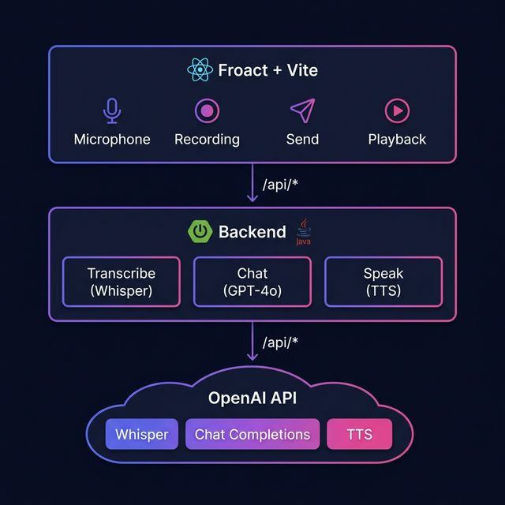

# 🎙️ AI Voice Assistant

A production-ready, full-stack voice assistant powered by **OpenAI APIs** — featuring speech-to-text, intelligent chat responses, and natural text-to-speech, all wrapped in a premium dark-themed UI.

> Think Alexa or Google Assistant, but customizable — with multilingual support, custom AI names, and wake word detection.

---

## ✨ Features

| Feature | Description |
|---------|-------------|
| 🗣️ **Voice Input** | Capture speech via browser microphone, transcribed by OpenAI Whisper |
| 🤖 **AI Chat** | Intelligent responses via GPT-4o with contextual conversation history |
| 🔊 **Voice Output** | Natural text-to-speech using OpenAI TTS with 6 voice options |
| 🎯 **Wake Word** | Trigger the AI by saying its name (e.g., *"Nova, tell me a joke"*) |
| 🌍 **9 Languages** | English, Spanish, German, French, Italian, Portuguese, Japanese, Chinese, Korean |
| ✏️ **Custom AI Name** | Name your assistant anything — Nova, Helga, Jarvis, etc. |
| 🎤 **Push-to-Talk & Continuous** | Two interaction modes for different use cases |

---

## 🏗️ Architecture

<p align="center">
  
</p>

### API Endpoints

| Method | Endpoint | Description |
|--------|----------|-------------|
| `POST` | `/api/audio/transcribe` | Upload audio → get transcription + wake word check |
| `POST` | `/api/chat/respond` | Send message → get AI response in selected language |
| `POST` | `/api/audio/speak` | Send text → get MP3 audio back |

---

## 🚀 Getting Started

### Prerequisites

- **Docker** (recommended) — OR Java 17+ and Node.js 18+
- **OpenAI API Key** ([Get one here](https://platform.openai.com/api-keys))

### 1. Clone the repository

```bash
git clone https://github.com/chemacabeza/test-ai-asistant.git
cd test-ai-asistant
```

### 2. Set up the OpenAI API Key

```bash
export OPENAI_API_KEY=sk-your-key-here
```

Or create a `.env` file (see `.env.example`).

### 3. Run with Docker (recommended)

```bash
./start.sh start
```

This will:
- ✅ Build the backend and frontend Docker images
- ✅ Start both containers
- ✅ Wait for the app to be healthy
- ✅ Open your browser automatically

Other commands:
```bash
./start.sh stop      # Stop all containers
./start.sh restart   # Restart everything
./start.sh logs      # Tail container logs
./start.sh status    # Show container status
```

### Alternative: Run without Docker

```bash
# Backend
cd backend
./mvnw spring-boot:run

# Frontend (separate terminal)
cd frontend
npm install
npm run dev
```

### 4. Use the app

1. Set your preferred **language** and **AI name**
2. Click the 🎤 microphone button
3. Say: *"Nova, what's the capital of France?"*
4. Listen to the AI respond in your chosen language! 🎉

---

## 🔧 Configuration

### Backend (`backend/src/main/resources/application.yml`)

| Property | Default | Description |
|----------|---------|-------------|
| `openai.model` | `gpt-4o` | Chat model |
| `openai.tts-model` | `tts-1` | TTS model |
| `openai.tts-voice` | `nova` | Default voice |
| `openai.whisper-model` | `whisper-1` | STT model |

### Available Voices

| Voice | Style |
|-------|-------|
| `alloy` | Neutral |
| `echo` | Male |
| `fable` | Expressive |
| `onyx` | Deep male |
| `nova` | Female |
| `shimmer` | Soft female |

---

## 🛡️ Security

- ✅ API key stored server-side only (environment variable)
- ✅ Frontend never sees the OpenAI key
- ✅ Backend proxies all OpenAI requests
- ✅ CORS configured for allowed origins only

---

## 📁 Project Structure

```
test-ai-asistant/
├── backend/
│   ├── Dockerfile
│   ├── .dockerignore
│   ├── pom.xml
│   └── src/main/java/com/voiceassistant/
│       ├── VoiceAssistantApplication.java
│       ├── config/          (OpenAiConfig, WebConfig)
│       ├── controller/      (AudioController, ChatController, HealthController)
│       ├── dto/             (ChatRequest/Response, SpeakRequest, TranscribeResponse)
│       ├── exception/       (GlobalExceptionHandler)
│       └── service/         (OpenAiService)
├── frontend/
│   ├── Dockerfile
│   ├── .dockerignore
│   ├── nginx.conf
│   ├── package.json
│   ├── vite.config.js
│   └── src/
│       ├── App.jsx
│       ├── index.css
│       ├── components/      (Header, SettingsPanel, ChatHistory, MicrophoneButton, StatusIndicator)
│       ├── hooks/           (useAudioRecorder, useWakeWord)
│       └── services/        (api.js)
├── docker-compose.yml
├── start.sh
├── .env.example
└── README.md
```

---

## 🔮 Roadmap

- [ ] PostgreSQL for user preferences & conversation history
- [ ] Streaming responses (real-time speech)
- [ ] Offline fallback for basic commands
- [ ] Wake word sensitivity tuning
- [ ] User authentication

---

## 📄 License

This project is licensed under the terms of the [LICENSE](LICENSE) file.
